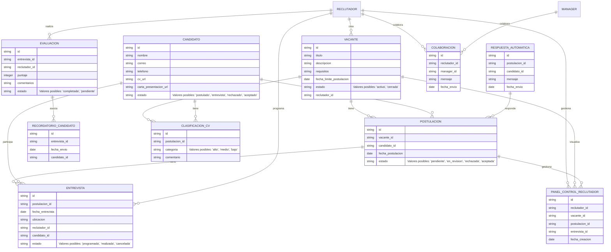
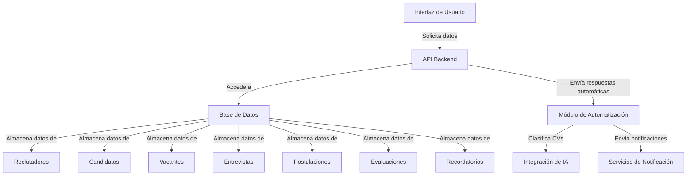
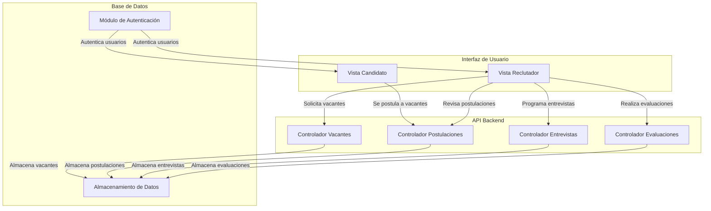

# Documentación del Sistema de Applicant-Tracking System (ATS) de LTI

## 1. Descripción del Software

LTI es un sistema de rastreo y gestión de candidatos (ATS) de nueva generación diseñado para optimizar los procesos de selección y contratación, mejorar la colaboración en tiempo real entre reclutadores y managers, y ofrecer automatizaciones avanzadas y asistencia basada en inteligencia artificial (IA) para las tareas más críticas de recursos humanos. Con un enfoque en la eficiencia, la colaboración y la precisión en la toma de decisiones, LTI busca revolucionar el flujo de trabajo de los departamentos de Recursos Humanos (RH) en empresas de cualquier tamaño, ayudándoles a encontrar y contratar el talento adecuado de manera más ágil y eficaz.

### Valor Añadido de LTI
La plataforma LTI va más allá de un ATS tradicional. En lugar de simplemente gestionar la información de los candidatos, LTI se enfoca en hacer que el proceso de contratación sea más ágil y colaborativo. Su propuesta de valor se centra en tres pilares:

1. **Automatización Inteligente**: LTI reduce la carga de trabajo manual al automatizar tareas repetitivas como la clasificación de CVs, el envío de correos de seguimiento, y la programación de recordatorios, liberando tiempo para que los reclutadores se concentren en tareas estratégicas.
2. **Colaboración en Tiempo Real**: Con herramientas como un chat en vivo, comentarios instantáneos y paneles compartidos, LTI permite que los reclutadores, managers y equipos de contratación colaboren de manera fluida y transparente, asegurando que las decisiones se tomen de manera informada y en menos tiempo.
3. **Asistencia Basada en IA**: Con el uso de IA avanzada, LTI facilita el análisis automático del tono en respuestas de entrevistas, recomienda candidatos ideales para vacantes específicas y clasifica CVs basándose en parámetros predefinidos y en aprendizaje continuo.

### Ventajas Competitivas
Para diferenciarse de los sistemas actuales, LTI incluye las siguientes ventajas competitivas:

1. **Automatización Avanzada y Personalizable**:
   - LTI permite personalizar los flujos de trabajo de automatización para cada organización, adaptándose a sus necesidades específicas. Desde respuestas automáticas hasta recordatorios de seguimiento y evaluaciones, LTI adapta las automatizaciones para cubrir el ciclo completo del reclutamiento.
   - Los competidores tienden a ofrecer automatizaciones estándar; LTI permite un ajuste de las reglas y configuraciones para un proceso altamente optimizado.

2. **Colaboración en Tiempo Real Mejorada**:
   - A diferencia de muchos ATS que funcionan como herramientas de registro, LTI ofrece una plataforma de colaboración que fomenta la comunicación en vivo entre reclutadores y managers. Con un sistema de chat integrado y la capacidad de dejar comentarios en tiempo real en perfiles de candidatos y vacantes, LTI asegura que todos los involucrados en la decisión tengan la información que necesitan al instante.
   - Esta ventaja competitiva destaca porque permite tomar decisiones rápidas y evita demoras en el flujo de trabajo, algo que la mayoría de los ATS en el mercado actual no ofrecen en la misma medida.

3. **Asistencia de IA para Decisiones Más Inteligentes**:
   - A través de un análisis de tono en respuestas de entrevistas, LTI proporciona información detallada sobre el comportamiento y la actitud de los candidatos, lo que ayuda a los reclutadores a tomar decisiones mejor informadas.
   - Con recomendaciones automáticas de candidatos y clasificación inteligente de CVs, LTI simplifica la búsqueda de talento y ayuda a los reclutadores a identificar de manera rápida y precisa a los candidatos con mayores posibilidades de éxito.
   - Pocos competidores en el mercado tienen IA con capacidades tan especializadas para el ATS, lo que otorga a LTI un valor diferencial significativo.

4. **Enfoque en la Experiencia del Reclutador**:
   - LTI está diseñado pensando en el usuario. La interfaz es intuitiva y está optimizada para reducir la curva de aprendizaje, con una navegación clara y un diseño que minimiza los pasos para realizar las tareas más comunes.
   - Además, se integra con otras herramientas y plataformas de comunicación, como correo electrónico y sistemas de calendario, lo que facilita su adopción e integración en los flujos de trabajo existentes de las empresas.


---
## 2. Explicación de las Funciones Principales de LTI

### Funciones Principales

1. **Clasificación Automática de CVs mediante IA**:
   - **Descripción**: Utiliza algoritmos de aprendizaje automático para analizar y clasificar CVs en función de habilidades, experiencia y relevancia para los roles específicos. Esto ayuda a los reclutadores a filtrar rápidamente grandes volúmenes de candidatos.
   - **Ventaja**: Reduce el tiempo de evaluación inicial, eliminando el esfuerzo manual en la fase de preselección.
   - **Función Innovadora**: Ofrece filtros configurables y mejoras continuas basadas en feedback, lo que permite afinar el sistema para necesidades específicas de cada organización.

2. **Automatización de Recordatorios y Respuestas para Candidatos**:
   - **Descripción**: Automatiza los envíos de recordatorios para entrevistas y correos de seguimiento a los candidatos. Los usuarios pueden personalizar la frecuencia, contenido y condiciones de estos mensajes, facilitando una comunicación eficiente.
   - **Ventaja**: Mejora la experiencia del candidato al mantenerlos informados y reduce la carga de trabajo manual en tareas de seguimiento.
   - **Función Innovadora**: Permite personalización avanzada del flujo de recordatorios y respuestas, adaptándose a los diferentes estilos de comunicación de las empresas.

3. **Panel de Control para el Reclutador**:
   - **Descripción**: Proporciona una vista centralizada donde los reclutadores pueden visualizar y gestionar todo el pipeline de candidatos, desde la recepción de CVs hasta la contratación.
   - **Ventaja**: Facilita la toma de decisiones informadas con estadísticas y métricas clave de cada etapa del proceso de reclutamiento.
   - **Función Innovadora**: Incluye capacidades de colaboración, lo que permite que otros stakeholders de RH y gerentes de contratación puedan visualizar y aportar comentarios sobre los candidatos en tiempo real.

4. **Análisis de Tono en Respuestas de Entrevistas**:
   - **Descripción**: Mediante algoritmos de procesamiento de lenguaje natural (NLP), LTI analiza el tono, la actitud y el nivel de compromiso percibido en las respuestas de los candidatos durante las entrevistas, lo cual ofrece una dimensión adicional de evaluación.
   - **Ventaja**: Agrega valor a la evaluación de los candidatos al ofrecer insights más profundos y ayuda a detectar alineación cultural con la empresa.
   - **Función Innovadora**: Este análisis se puede combinar con las notas de los reclutadores, proporcionando una visión integral del perfil del candidato.

5. **Colaboración en Tiempo Real entre Reclutadores y Managers**:
   - **Descripción**: A través de un sistema de chat en vivo y la capacidad de dejar comentarios en tiempo real, los reclutadores y managers pueden comunicarse y colaborar instantáneamente en el perfil de un candidato o en el proceso de una vacante específica.
   - **Ventaja**: Agiliza la toma de decisiones y permite una comunicación más fluida, evitando demoras típicas de los ATS tradicionales.
   - **Función Innovadora**: La función de chat en vivo se integra con el sistema de gestión de vacantes, permitiendo que las conversaciones y las decisiones se registren y se mantengan accesibles para referencia futura.

6. **Evaluación Automatizada de Candidatos**:
   - **Descripción**: LTI permite que los candidatos sean evaluados automáticamente según criterios predefinidos, lo que proporciona una puntuación cuantitativa de cada perfil.
   - **Ventaja**: Estandariza y simplifica las evaluaciones iniciales, reduciendo posibles sesgos y acelerando el proceso de selección.
   - **Función Innovadora**: Los criterios de evaluación son altamente personalizables y pueden ajustarse en función de las habilidades y competencias que cada organización valore más en sus procesos de contratación.

---

## 3. Lean Canvas de LTI - Applicant Tracking System

| Sección                  | Detalles                                                                                                      |
|--------------------------|--------------------------------------------------------------------------------------------------------------|
| **Problema**             | 1. Procesos de selección largos y costosos.                                                                  |
|                          | 2. Falta de colaboración eficiente en tiempo real entre reclutadores y managers.                              |
|                          | 3. Bajo engagement de los candidatos debido a comunicaciones poco personalizadas o lentas.                    |
| **Segmentos de Clientes**| 1. Pequeñas y medianas empresas.                                                                             |
|                          | 2. Departamentos de Recursos Humanos que desean mejorar la eficiencia del reclutamiento.                     |
|                          | 3. Consultoras de reclutamiento que manejan múltiples procesos simultáneamente.                               |
| **Propuesta de Valor**   | 1. Automatización de tareas repetitivas (evaluación de CVs, recordatorios, respuestas automáticas).          |
|                          | 2. Colaboración en tiempo real entre reclutadores y managers.                                                 |
|                          | 3. Análisis avanzado mediante IA (análisis de tono en entrevistas, clasificación automática de candidatos).   |
| **Solución**             | 1. Clasificación automática de CVs con IA.                                                                   |
|                          | 2. Automatización de recordatorios y respuestas personalizadas para candidatos.                              |
|                          | 3. Chat en vivo y comentarios colaborativos en perfiles de candidatos.                                       |
|                          | 4. Evaluación automatizada de candidatos según criterios configurables.                                      |
| **Canales**              | 1. Plataforma accesible en web y dispositivos móviles.                                                       |
|                          | 2. Integración con sistemas de gestión de recursos humanos (HRIS) y redes profesionales.                      |
| **Estructura de Costos** | 1. Costos de desarrollo y mantenimiento.                                                                     |
|                          | 2. Gastos de infraestructura en la nube.                                                                     |
|                          | 3. Inversión en marketing y ventas para captación de nuevos clientes.                                        |
| **Ingresos**             | 1. Suscripción mensual según el número de usuarios y funcionalidades contratadas.                            |
|                          | 2. Servicios premium con análisis avanzados y funciones de automatización personalizadas.                     |
| **Métricas Clave**       | 1. Tiempo promedio de contratación.                                                                          |
|                          | 2. Nivel de engagement de los usuarios en la plataforma.                                                     |
|                          | 3. Tasa de retención y satisfacción de clientes.                                                             |
| **Ventaja Competitiva**  | Funcionalidades de automatización avanzada y colaboración en tiempo real no comunes en ATS tradicionales.    |

---

### Resumen del Lean Canvas en Diagrama de Texto

```plaintext
Lean Canvas de LTI - Applicant Tracking System

1. Problema:
   - Procesos largos y costosos
   - Falta de colaboración en tiempo real
   - Bajo engagement de candidatos

2. Segmentos de Clientes:
   - PYMEs
   - Departamentos de Recursos Humanos
   - Consultoras de reclutamiento

3. Propuesta de Valor:
   - Automatización de tareas repetitivas
   - Colaboración en tiempo real
   - Análisis avanzado con IA

4. Solución:
   - Clasificación automática de CVs
   - Recordatorios y respuestas automatizadas
   - Chat en vivo para colaboración
   - Evaluación automática de candidatos

5. Canales:
   - Plataforma web y móvil
   - Integración con sistemas de RH y redes sociales

6. Estructura de Costos:
   - Desarrollo y mantenimiento
   - Infraestructura en la nube
   - Marketing y ventas

7. Ingresos:
   - Suscripción mensual
   - Servicios premium

8. Métricas Clave:
   - Tiempo promedio de contratación
   - Nivel de engagement de usuarios
   - Retención de clientes

9. Ventaja Competitiva:
   - Automatización avanzada y colaboración en tiempo real.
```


---

## 4. Casos de Uso

A continuación te detallo cada uno de los casos de uso con el formato estándar que incluye actores, flujos alternos y demás elementos relevantes. Cada uno con su diagrama en formato Mermaid al final de cada uno.

---

### **0. Iniciar Sesión**

**Actor Principal**: Reclutador

**Actores Secundarios**: Ninguno

**Precondiciones**:
- El reclutador debe tener una cuenta registrada en el sistema.

**Postcondiciones**:
- El reclutador es autenticado y redirigido a su panel correspondiente.

**Flujo Principal**:
1. El reclutador accede a la página de inicio de sesión.
2. El reclutador ingresa su correo electrónico y contraseña.
3. El reclutador hace clic en el botón "Iniciar Sesión".
4. El sistema valida las credenciales.
5. Si las credenciales son válidas, el reclutador es redirigido a su panel de control.
6. Si las credenciales son inválidas, se muestra un mensaje de error.

**Flujos Alternos**:
- **Flujo Alterno 1 (Error en el inicio de sesión)**: Si el reclutador ingresa un correo electrónico o contraseña incorrectos, se muestra un mensaje de error indicando que las credenciales son inválidas.

**Excepciones**:
- El sistema no está disponible debido a problemas técnicos.

**Diagrama de Caso de Uso (Mermaid)**:
```mermaid
usecaseDiagram
  actor Reclutador
  Reclutador --> (Iniciar Sesión)
  (Iniciar Sesión) --> (Validar Credenciales)
  (Iniciar Sesión) --> (Redirigir a Panel)
```

---

### **1. Crear Vacante**

**Actor Principal**: Usuario

**Actores Secundarios**: Ninguno

**Precondiciones**:
- El reclutador debe estar autenticado en el sistema.

**Postcondiciones**:
- La vacante se crea y queda registrada en el sistema para su publicación.

**Flujo Principal**:
1. El reclutador accede a la sección "Crear Vacante" desde el panel de control.
2. El reclutador completa los campos obligatorios: título de la vacante, descripción, requisitos y fecha límite de postulación.
3. El reclutador selecciona la opción de "Publicar" para hacer visible la vacante.
4. El sistema confirma que la vacante ha sido creada y publicada correctamente.

**Flujos Alternos**:
- **Flujo Alterno 1 (Falta información obligatoria)**: Si algún campo obligatorio no ha sido completado, el sistema muestra un mensaje de error y pide completar los campos faltantes.

**Excepciones**:
- El reclutador no tiene permisos para crear vacantes (si no está autenticado correctamente).

**Diagrama de Caso de Uso (Mermaid)**:
```mermaid
usecaseDiagram
  actor Reclutador
  Reclutador --> (Crear Vacante)
  (Crear Vacante) --> (Completar Formulario)
  (Crear Vacante) --> (Publicar Vacante)
```

---

### **2. Postular Candidato**

**Actor Principal**: Candidato

**Actores Secundarios**: Reclutador (para visualización de postulaciones)

**Precondiciones**:
- El candidato debe estar registrado en el sistema.

**Postcondiciones**:
- El candidato queda registrado como postulante a la vacante seleccionada.

**Flujo Principal**:
1. El candidato accede a la vacante desde el portal de vacantes.
2. El candidato completa los datos necesarios (CV, carta de presentación, etc.).
3. El candidato selecciona "Postularme" para enviar su aplicación.
4. El sistema confirma la postulación y notifica al reclutador sobre la nueva aplicación.

**Flujos Alternos**:
- **Flujo Alterno 1 (Falta información obligatoria)**: Si falta algún dato obligatorio (CV, carta de presentación), el sistema muestra un mensaje de error indicando qué campos faltan.

**Excepciones**:
- El candidato intenta postularse a una vacante cerrada (vacante ya no está disponible).

**Diagrama de Caso de Uso (Mermaid)**:
```mermaid
usecaseDiagram
  actor Candidato
  Candidato --> (Postular Candidato)
  (Postular Candidato) --> (Completar Información)
  (Postular Candidato) --> (Enviar Postulación)
  (Postular Candidato) --> (Notificar Reclutador)
```

---

### **3. Clasificación Automática de CVs**

**Actor Principal**: Sistema (Automático)

**Actores Secundarios**: Reclutador

**Precondiciones**:
- Los CVs deben haber sido enviados y están listos para ser clasificados.

**Postcondiciones**:
- El sistema clasifica los CVs en diferentes categorías según los requisitos de la vacante.

**Flujo Principal**:
1. El sistema recibe los CVs de los candidatos postulados.
2. El sistema analiza cada CV utilizando un algoritmo de clasificación (basado en palabras clave, experiencia, etc.).
3. El sistema clasifica los CVs en categorías como "Alto", "Medio", "Bajo".
4. El sistema notifica al reclutador con los resultados de la clasificación.

**Flujos Alternos**:
- **Flujo Alterno 1 (Error en la clasificación)**: Si el sistema no puede clasificar un CV, se notifica al reclutador que la clasificación no fue posible.

**Excepciones**:
- El sistema no tiene suficientes datos para realizar una clasificación precisa.

**Diagrama de Caso de Uso (Mermaid)**:
```mermaid
usecaseDiagram
  actor Sistema
  actor Reclutador
  Sistema --> (Clasificación Automática de CVs)
  (Clasificación Automática de CVs) --> (Analizar CVs)
  (Clasificación Automática de CVs) --> (Clasificar CVs)
  (Clasificación Automática de CVs) --> (Notificar Reclutador)
```

---

### **4. Programar Entrevista**

**Actor Principal**: Reclutador

**Actores Secundarios**: Candidato

**Precondiciones**:
- El reclutador ha revisado los CVs y desea programar una entrevista con el candidato seleccionado.

**Postcondiciones**:
- La entrevista queda programada y tanto el reclutador como el candidato son notificados.

**Flujo Principal**:
1. El reclutador selecciona al candidato para la entrevista.
2. El reclutador elige la fecha y hora para la entrevista.
3. El sistema confirma la programación de la entrevista y envía una invitación al candidato.
4. El sistema notifica a ambos, reclutador y candidato, sobre la entrevista programada.

**Flujos Alternos**:
- **Flujo Alterno 1 (Fecha no disponible)**: Si la fecha seleccionada no está disponible, el sistema muestra un mensaje de error y permite seleccionar otra fecha.

**Excepciones**:
- El reclutador no tiene permisos para programar entrevistas.

**Diagrama de Caso de Uso (Mermaid)**:
```mermaid
usecaseDiagram
  actor Reclutador
  actor Candidato
  Reclutador --> (Programar Entrevista)
  (Programar Entrevista) --> (Seleccionar Fecha y Hora)
  (Programar Entrevista) --> (Enviar Invitación)
  (Programar Entrevista) --> (Notificar Candidato)
```

---

### **5. Enviar Recordatorio a Candidato**

**Actor Principal**: Sistema (Automático)

**Actores Secundarios**: Reclutador

**Precondiciones**:
- La entrevista ya ha sido programada.

**Postcondiciones**:
- El candidato recibe un recordatorio sobre la entrevista programada.

**Flujo Principal**:
1. El sistema revisa las entrevistas programadas.
2. El sistema envía un recordatorio automático al candidato 24 horas antes de la entrevista.
3. El sistema notifica al reclutador que el recordatorio fue enviado.

**Flujos Alternos**:
- Ninguno

**Excepciones**:
- El sistema no puede enviar el recordatorio por error de conexión.

**Diagrama de Caso de Uso (Mermaid)**:
```mermaid
usecaseDiagram
  actor Sistema
  actor Reclutador
  Sistema --> (Enviar Recordatorio a Candidato)
  (Enviar Recordatorio a Candidato) --> (Notificar Candidato)
  (Enviar Recordatorio a Candidato) --> (Notificar Reclutador)
```

---

### **6. Enviar Respuesta Automática a Candidato**

**Actor Principal**: Sistema (Automático)

**Actores Secundarios**: Reclutador

**Precondiciones**:
- El candidato ha postulado para una vacante.

**Postcondiciones**:
- El candidato recibe una respuesta automática confirmando la recepción de su postulación.

**Flujo Principal**:
1. El sistema recibe una nueva postulación.
2. El sistema envía una respuesta automática al candidato confirmando la recepción.
3. El sistema notifica al reclutador sobre la postulación.

**Flujos Alternos**:
- Ninguno

**Excepciones**:
- El sistema no puede enviar la respuesta por error de sistema.

**Diagrama de Caso de Uso (Mermaid)**:
```mermaid
usecaseDiagram
  actor Sistema
  actor Reclutador
  Sistema --> (Enviar Respuesta Automática a Candidato)
  (Enviar Respuesta Automática a Candidato) --> (Confirmar Recepción)
  (Enviar Respuesta Automática a Candidato) --> (Notificar Reclutador)
```

---

### **7. Evaluación de Candidato**

**Actor Principal**: Reclutador

**Actores Secundarios**: Ninguno

**Precondiciones**:
- El reclutador ha entrevistado al candidato.

**Postcondiciones**:
- El reclutador ha completado la evaluación del candidato.

**Flujo Principal**:
1. El reclutador accede a la sección de evaluación del candidato.
2. El reclutador califica al candidato según los criterios establecidos.
3. El reclutador guarda la evaluación.

**Flujos Alternos**:
- Ninguno

**Excepciones**:
- El reclutador no ha completado todos los campos obligatorios de la evaluación.

**Diagrama de Caso de Uso (Mermaid)**:
```mermaid
usecaseDiagram
  actor Reclutador
  Reclutador --> (Evaluar Candidato)
  (Evaluar Candidato) --> (Calificar Candidato)
  (Evaluar Candidato) --> (Guardar Evaluación)
```

---

### **8. Análisis de Tono en Entrevistas**

**Actor Principal**: Sistema (Automático)

**Actores Secundarios**: Reclutador

**Precondiciones**:
- La entrevista del candidato ha sido grabada.

**Postcondiciones**:
- El sistema proporciona un análisis del tono de la entrevista.

**Flujo Principal**:
1. El sistema recibe la grabación de la entrevista.
2. El sistema realiza un análisis de tono utilizando técnicas de procesamiento de lenguaje natural.
3. El sistema genera un informe con los resultados del análisis.

**Flujos Alternos**:
- **Flujo Alterno 1 (Error en el análisis)**: Si el sistema no puede procesar la grabación, se notifica al reclutador que el análisis no se pudo realizar.

**Excepciones**:
- La grabación no está disponible o está en un formato no compatible.

**Diagrama de Caso de Uso (Mermaid)**:
```mermaid
usecaseDiagram
  actor Sistema
  actor Reclutador
  Sistema --> (Análisis de Tono en Entrevistas)
  (Análisis de Tono en Entrevistas) --> (Procesar Grabación)
  (Análisis de Tono en Entrevistas) --> (Generar Informe)
```

---

### **9. Colaboración en Tiempo Real entre Reclutadores y Managers**

**Actor Principal**: Reclutador

**Actores Secundarios**: Manager

**Precondiciones**:
- Ambos actores deben estar autenticados y ser parte del proceso de contratación.

**Postcondiciones**:
- El reclutador y el manager pueden intercambiar información en tiempo real sobre candidatos.

**Flujo Principal**:
1. El reclutador y el manager acceden a la sección de colaboración en tiempo real.
2. Ambos pueden enviar mensajes, compartir notas y discutir detalles sobre los candidatos.

**Flujos Alternos**:
- Ninguno

**Excepciones**:
- El sistema no está disponible debido a problemas técnicos.

**Diagrama de Caso de Uso (Mermaid)**:
```mermaid
usecaseDiagram
  actor Reclutador
  actor Manager
  Reclutador --> (Colaborar en Tiempo Real)
  Manager --> (Colaborar en Tiempo Real)
  (Colaborar en Tiempo Real) --> (Enviar Mensajes)
  (Colaborar en Tiempo Real) --> (Compartir Notas)
```

---

### **10. Visualizar Panel de Control del Reclutador**

**Actor Principal**: Reclutador

**Actores Secundarios**: Ninguno

**Precondiciones**:
- El reclutador debe estar autenticado en el sistema.

**Postcondiciones**:
- El reclutador tiene acceso a una vista consolidada de todas las vacantes, postulaciones y entrevistas.

**Flujo Principal**:
1. El reclutador accede al panel de control.
2. El sistema muestra una vista consolidada con estadísticas y acciones para las vacantes activas.
3. El reclutador puede realizar acciones como crear nuevas vacantes o revisar postulaciones.

**Flujos Alternos**:
- Ninguno

**Excepciones**:
- El reclutador no tiene permisos para acceder al panel.

**Diagrama de Caso de Uso (Mermaid)**:
```mermaid
usecaseDiagram
  actor Reclutador
  Reclutador --> (Visualizar Panel de Control)
  (Visualizar Panel de Control) --> (Ver Vacantes Activas)
  (Visualizar Panel de Control) --> (Revisar Postulaciones)
```

---

## 5. Modelo de Datos

A continuación, te presento un modelo de datos en formato Mermaid que cubre todos los casos de uso mencionados. El modelo está estructurado de manera que sea escalable y flexible para futuras expansiones del sistema. Incluye las entidades necesarias para manejar vacantes, postulaciones, entrevistas, evaluaciones, recordatorios, y otros componentes relacionados con el proceso de reclutamiento.



### Explicación de Entidades y Relaciones:
- **VACANTE**: Representa una vacante creada por un reclutador. Tiene campos como `titulo`, `descripcion`, `requisitos`, `fecha_limite_postulacion` y `estado`. Cada vacante está asociada a un reclutador (`reclutador_id`).
  
- **CANDIDATO**: Contiene información sobre los candidatos, como `nombre`, `correo`, `telefono`, y `cv_url`. Además, tiene un estado (`estado`) que indica si el candidato está "postulado", "en entrevista", "rechazado" o "aceptado".

- **POSTULACION**: Relaciona a los candidatos con las vacantes a las que se postulan. Almacena la `fecha_postulacion` y su estado (`pendiente`, `en_revision`, `rechazada`, `aceptada`).

- **ENTREVISTA**: Representa una entrevista programada entre un reclutador y un candidato. Incluye la `fecha_entrevista`, `ubicacion`, y el estado de la entrevista (`programada`, `realizada`, `cancelada`).

- **EVALUACION**: Almacena los resultados de la evaluación realizada por un reclutador tras una entrevista. Incluye el `puntaje` y `comentarios` sobre el candidato.

- **RECORDATORIO_CANDIDATO**: Representa un recordatorio enviado al candidato antes de su entrevista. Se genera automáticamente para asegurar que el candidato esté al tanto de la entrevista programada.

- **RESPUESTA_AUTOMATICA**: Se refiere a la respuesta que el sistema envía automáticamente al candidato cuando su postulación es recibida.

- **CLASIFICACION_CV**: Relaciona las postulaciones con la clasificación automática de los CVs. Los CVs se clasifican en categorías como "alto", "medio" o "bajo" según su relevancia para la vacante.

- **COLABORACION**: Representa la colaboración entre el reclutador y el manager en el proceso de selección. Ambos pueden intercambiar mensajes relacionados con las vacantes y candidatos.

- **PANEL_CONTROL_RECLUTADOR**: Es el panel de control que permite al reclutador gestionar sus vacantes, postulaciones y entrevistas, facilitando un acceso rápido a las acciones que necesita realizar.

### Relaciones:
- **VACANTE** tiene múltiples **POSTULACION**s.
- **CANDIDATO** puede realizar múltiples **POSTULACION**s.
- **POSTULACION** puede tener una o más **ENTREVISTA**s.
- **CANDIDATO** puede tener múltiples **ENTREVISTA**s.
- **EVALUACION** se vincula a una **ENTREVISTA**.
- **RECLUTADOR** crea **VACANTE**s y realiza **EVALUACION**es.
- **CANDIDATO** tiene una **CLASIFICACION_CV** para cada postulación.
- **RECLUTADOR** y **MANAGER** colaboran en la selección mediante el **COLABORACION**.
- **PANEL_CONTROL_RECLUTADOR** agrupa la gestión de vacantes, postulaciones y entrevistas de un reclutador.

## 6. Diseño del Sistema a Alto Nivel

**Explicación:**
El sistema de ATS (Applicant-Tracking System) estará compuesto por los siguientes módulos principales:

- **Interfaz de Usuario (UI):** Proporciona las interfaces para que los reclutadores y candidatos interactúen con el sistema. Se divide en dos vistas principales: la vista de reclutador y la vista de candidato.
- **API Backend:** Encargado de gestionar la lógica del negocio, procesar solicitudes de los usuarios y comunicarse con la base de datos.
- **Base de Datos (DB):** Almacena toda la información del sistema, incluyendo datos de candidatos, vacantes, postulaciones, entrevistas, evaluaciones y recordatorios.
- **Módulo de Automatización:** Implementa funcionalidades como respuestas automáticas a candidatos, recordatorios y la clasificación automática de CVs.
- **Integración de IA:** Realiza análisis de tono en entrevistas y clasifica los CVs utilizando modelos de IA.
- **Servicios de Notificación:** Envío de correos electrónicos, notificaciones push o SMS a los candidatos y reclutadores.

**Diagrama de Diseño a Alto Nivel (Mermaid):**



## 7. Diagramas C4: Componentes Principales

**Explicación:**
Este diagrama C4 describe los componentes más importantes dentro del sistema ATS, proporcionando una visión más detallada del flujo de información entre ellos. 

Los principales componentes del sistema incluyen:
- **Interfaz de Usuario (UI):** 
  - **Vista del Reclutador:** Gestiona la creación de vacantes, revisión de postulaciones y entrevistas.
  - **Vista del Candidato:** Permite a los candidatos postularse a vacantes, seguir el estado de sus postulaciones y recibir notificaciones.
- **API Backend:**
  - **Controlador de Vacantes:** Gestiona las solicitudes relacionadas con vacantes.
  - **Controlador de Postulaciones:** Gestiona las postulaciones de candidatos.
  - **Controlador de Entrevistas:** Administra las entrevistas programadas.
  - **Controlador de Evaluaciones:** Procesa las evaluaciones realizadas por los reclutadores.
- **Base de Datos:**
  - **Módulo de Autenticación:** Gestiona la autenticación y la autorización de usuarios.
  - **Almacenamiento de Datos:** Maneja la persistencia de datos de los postulantes, vacantes, entrevistas, evaluaciones, etc.

**Diagrama C4 de Componentes Principales (Mermaid):**



Este diagrama proporciona una representación más detallada de cómo interactúan los componentes dentro de la API Backend y cómo se conectan con la Interfaz de Usuario y la Base de Datos. También muestra cómo los datos fluyen entre las diferentes capas del sistema, desde la interfaz hasta la base de datos, pasando por los controladores en el backend.